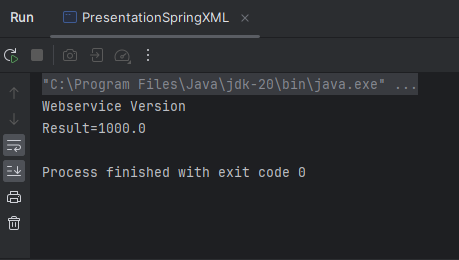

<h1>Injection des dépendances</h1>

<li>Par instanciation statique</li>
<li>Par instanciation dynamique</li>

<h2>En utilisant le Framework Spring: </h2>

<h3>- Version annotations</h3>

<h3>- Version XML</h3>

<h3>Diagram</h3>

